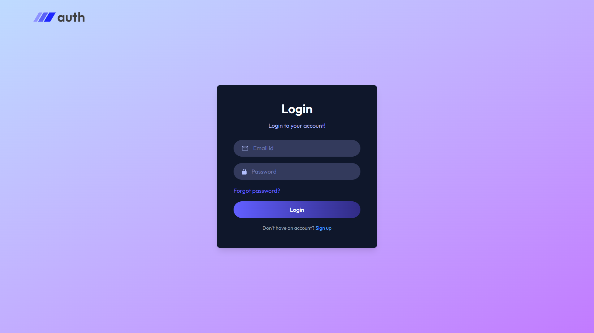
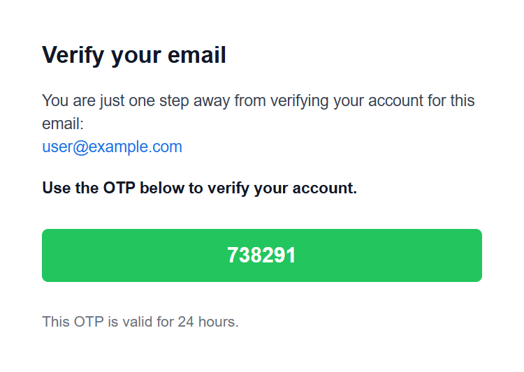
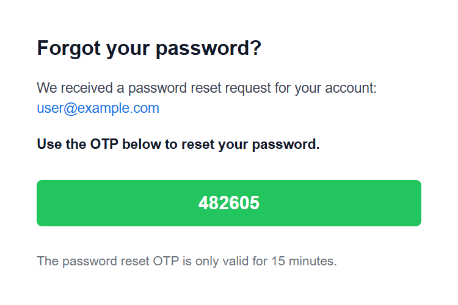
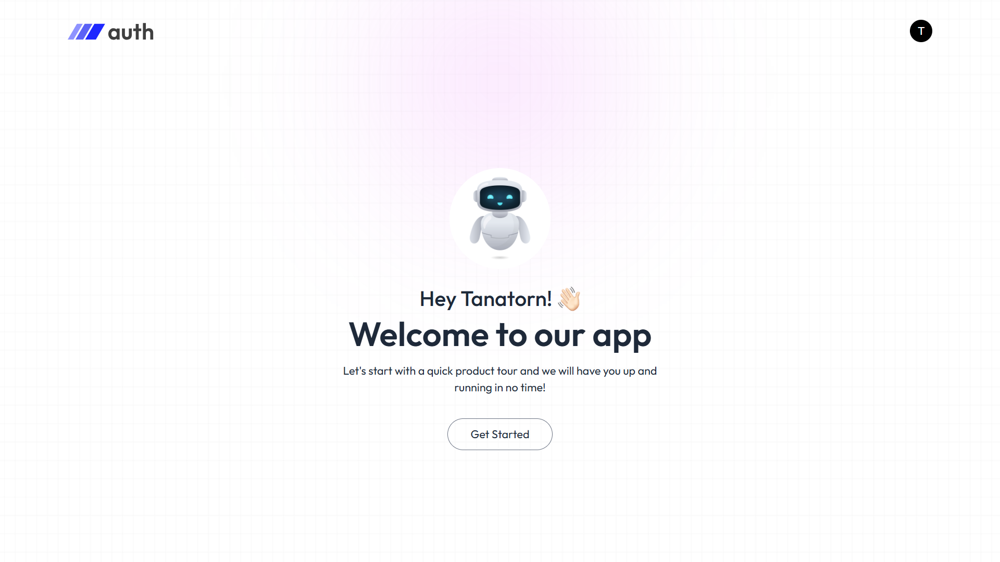

# 🔐 Complete MERN Authentication System

A full-stack authentication system built using the MERN stack (MongoDB, Express, React, Node.js).

This project implements secure JWT-based authentication with email verification (OTP) and password reset functionality.  
It demonstrates full authentication flow with protected routes and HTTP-only cookies.

---

## 🚀 Tech Stack

### Frontend
- React (Vite)
- React Router DOM
- Axios
- Context API (Global State Management)
- Tailwind CSS
- React Toastify

### Backend
- Node.js
- Express.js
- MongoDB (Mongoose)
- JWT (jsonwebtoken)
- bcryptjs (Password hashing)
- Nodemailer (Email service)
- Cookie-parser
- CORS

---

## ✨ Core Features

- 🔐 User Registration
- 🔑 Secure Login with JWT (HTTP-only cookies)
- 📩 Email Verification using OTP
- 🔄 Password Reset via OTP
- 🛡 Protected Routes
- 🔍 User Authentication Check
- 🚪 Logout functionality
- 🌐 Full client-server separation (REST API)

---

## 🔄 Authentication Flow

1. User registers → password hashed → JWT issued → OTP sent via email
2. User verifies account using OTP
3. User logs in → JWT stored in HTTP-only cookie
4. Protected routes require valid authentication
5. Forgot password → reset OTP → set new password

---

## 📸 Screenshots

### 🔐 Login Page


### 📩 Email Verification (OTP)


### 🔄 Reset Password


### 🏠 Home Page (Authenticated User)


---

## 📂 Project Structure

```plaintext
mern-auth-system/
│
├── client/                  # React frontend
│   ├── public/
│   └── src/
│       ├── assets/          # Images & static assets
│       ├── components/      # Reusable UI components
│       ├── context/         # Global state (Context API)
│       ├── pages/           # Application pages
│       ├── App.jsx
│       └── main.jsx
│
├── server/                  # Express backend
│   ├── config/              # Database & email configuration
│   ├── controllers/         # Business logic
│   ├── middleware/          # Authentication middleware
│   ├── models/              # Mongoose schemas
│   ├── routes/              # API routes
│   ├── .env
│   └── server.js
│
└── README.md
```

---

## 🛠 Local Development Setup

> ⚠ This project runs locally. Email functionality requires a valid SMTP configuration.

---

### 1️⃣ Clone the Repository

```bash
git clone https://github.com/ThnthrP/Complete-MERN-Authentication-System-With-Password-Reset-Email-Verification-JWT-auth.git
cd mern-auth-system
